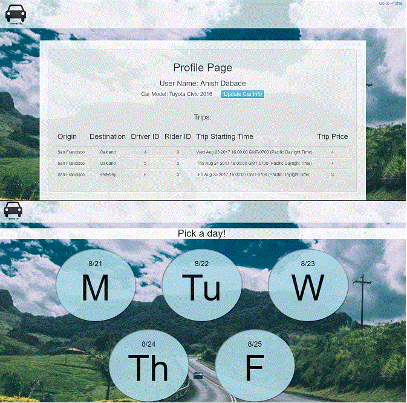
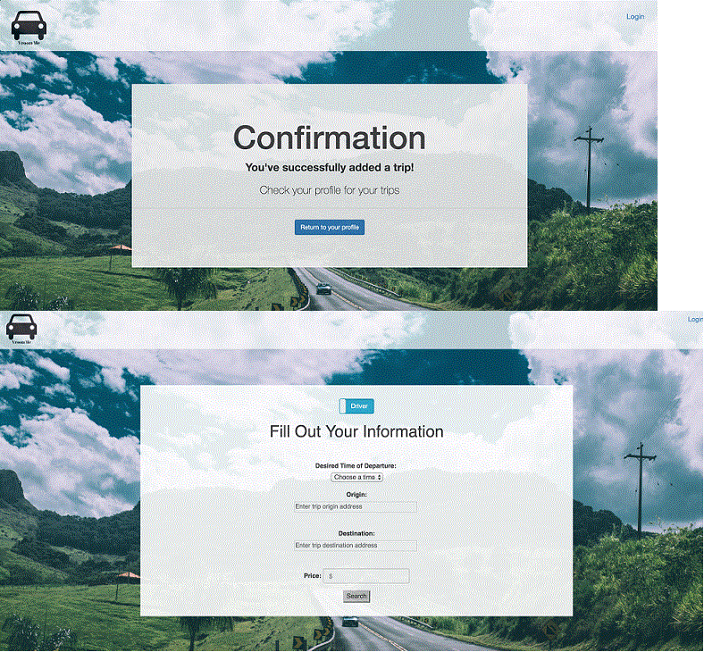

# vroomMe

An app to connect passengers to drivers based on merit, car model, and price for a safe commute to work!

 

## Overview
  
  A carpooling app to connect passengers to drivers based on merit, car model, and price for a safe commute to work!

## Table of Contents

- [Why Have This App](#why-have-this-app)
- [VroomMe Was Born](#vroomme-was-born)
- [Install the App Locally](#downloading-and-installing)
- [Additional Features to Incorporate](#additional-features-to-incorporate)

## Why Have This App

Why a carpooling app?     WHY NOT!?  

Everyday the daily "grind" in places like the Bay Area gets rougher and rougher.  And meeting up with people who can match up with your schedule, either as a rider or a driver is tough!  Going it alone definitely winds you up with either drivers or riders who are far from you, don't really travel your route or maybe are just unreliable...

Therefore...

## ...VroomMe was born 

VroomMe was meant to bridge that gap.  The VroomMe application uses Google authentication to log you in to a secure database that stores information pertinent to your carpooling needs:
    --Driver/rider names
    --Starting destinations
    --Matching riders and drivers based on a maximum 2 mile radius
    --Allowing riders to choose their driver based on criteria of car information, suggested price, etc.
    --Records and saves your trips for future reference

##  Downloading and Installing

Should you choose to clone this app to your computer, here's how to do it:
    - Clone the package to your machine

        == from the CLI
           "git clone https://github.com/nagaseri/vroomMe.git"

        == from the Github wepage
           go to https://github.com/nagaseri/vroomMe and click on the GREEN clone or download button
    
    - After you've cloned the package, change to the directory on your CLI and run:
        == "npm install"  to get the required packages
    - Run "node server.js"
    - Be sure to have MySQL community server installed to have a working DB to connect to.

You can also run the working version from
    https://vroom-me.herokuapp.com/

## Additional Features to Incorporate

Some features that the VroomMe team look to incorporate in the near future:
    -- Star system for rating your driver
    -- Additional criteria for matching rider/driver
        == eating allowed in car
        == wants an engaging ride
        == wants to work while riding to destination
        == music selections
    -- Alternate ways to pay: Paypal, Apple

